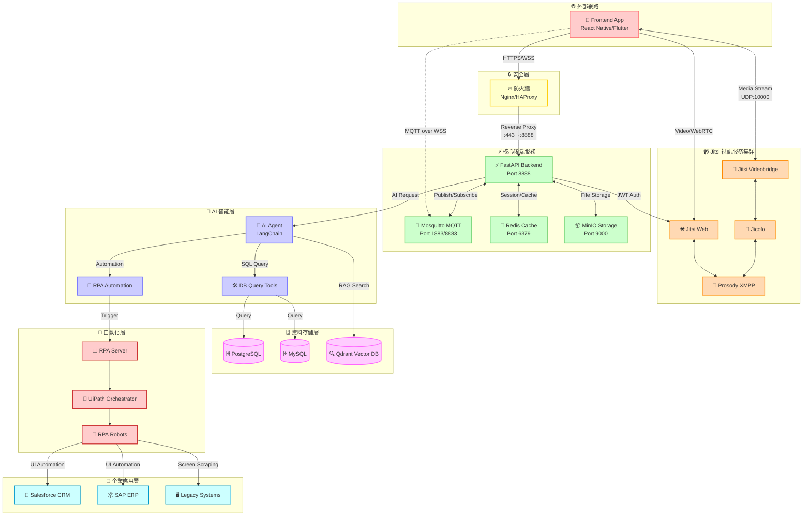
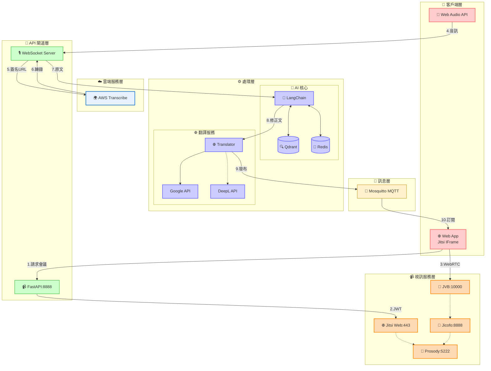

# TeamSync 網路通訊流程圖

## 系統架構概覽

本文件描述 TeamSync 後端系統的網路通訊架構，展示行動前端如何通過防火牆與後端互動，以及 AI 工作流程如何安全地訪問內部資料庫和企業系統。

## 網路架構圖（含 RPA 整合）

## TeamSync 視訊會議與智能轉錄功能架構

本節詳細說明 TeamSync 的進階功能：Jitsi 視訊會議整合與即時智能轉錄系統。

### 視訊會議與轉錄整合架構圖

